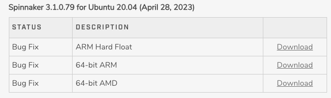

# A ROS Drvier Package for Ubuntu 20.04 and FLIR Spinnaker SDK 3

## 1. Getting Started

### 1.1 Install [Spinnaker SDK](https://www.flir.com/products/spinnaker-sdk/)


> Choose the appropriate c++ version of the SDK above and download it

### 1.2 Usage

Put the following code block into the `src/CMakeLists.txt`

```Cmakelists
# find FLIR
set(FLIR_ROOT "/opt/spinnaker")
find_path(FLIR_INCLUDE_DIR 
    NAMES include/Spinnaker.h
    PATHS ${FLIR_ROOT})
find_library(FLIR_LIBRARY
  NAMES libSpinnaker.so
  PATHS ${FLIR_ROOT}/lib/
)
set(FLIR_LIBRARYS ${FLIR_LIBRARY})
set(FLIR_INCLUDE_DIRS ${FLIR_INCLUDE_DIR} ${FLIR_ROOT}/include)
```

Then build and run it
```bash
rosrun flir_ros_driver flir_node
```
